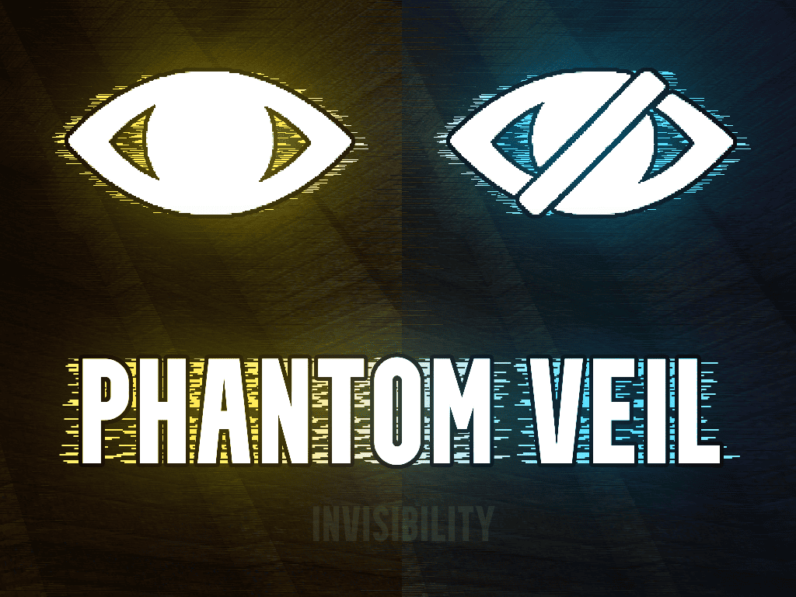

# PHANTOM VEIL

A GZDoom / UZDoom mod that adds an activatable invisibility ability with its own energy system, HUD indicator, visual shaders, and optional monster decoy logic.

## What this mod does

Phantom Veil adds a manually activated invisibility ability to the game.

The player can toggle invisibility with a dedicated key.  
While the ability is active:

- the player becomes difficult or impossible for monsters to detect;
- visual invisibility shaders are enabled;
- a dedicated energy pool is consumed;
- a HUD indicator shows the current amount of energy;
- an optional decoy object can influence monster behavior.

When the charge runs out, or when the player manually disables the ability, invisibility ends and the energy starts regenerating again.

The mod does not replace weapons, monsters, or maps. It works as an additional gameplay system on top of compatible Doom content.

## Main features

- Activatable invisibility ability
- Dedicated energy meter
- Energy drain while active
- Automatic recharge after deactivation
- HUD indicator with position and size settings
- Dedicated invisibility shader effects
- Optional monster decoy behavior
- Key binding directly from the mod menu
- GZDoom / UZDoom support

## How it works

The player has a separate invisibility energy reserve.

When the activation key is pressed:
- invisibility turns on;
- an activation sound is played;
- the energy meter starts draining;
- the HUD icon switches to the active state;
- shader effects are enabled.

When the energy reaches zero:
- invisibility turns off automatically;
- a deactivation sound is played;
- the meter empties;
- then it starts recharging.

The player can also manually disable invisibility by pressing the activation key again.

## Monster logic

Phantom Veil supports two monster behavior modes.

### Monster Decoy Logic = ON

This is the default mode.

When invisibility is activated, a special decoy object is spawned near the activation point. Its purpose is to keep monsters behaviorally engaged instead of making them simply freeze after losing the player.

Mode behavior:

- only one decoy object can exist at a time;
- when invisibility starts, monsters may redirect their attention to the decoy;
- the decoy does not follow the player;
- after invisibility ends, the decoy stops holding monster attention;
- as soon as monsters reacquire the player, the decoy is removed.

### Monster Decoy Logic = OFF

In this mode, the extra monster decoy system is completely disabled.

This means:

- no decoy object is spawned;
- the mod uses the simpler invisibility logic only;
- monster behavior depends entirely on the player concealment state.

## HUD indicator

The mod uses two icon states:

- `IVPL.png` — idle / recharge state
- `IVPM.png` — active invisibility state

HUD behavior:

- when invisibility is inactive, the normal icon is shown;
- when invisibility is active, the active icon is shown;
- the meter inside the icon shows the current amount of charge;
- it decreases while invisibility is active;
- it increases while the system is recharging.

The HUD indicator position and size can be adjusted from the menu.

## Shaders

The mod uses two shader files:

- `ivshader.fp`
- `ivloop.fp`

They are used to create the invisibility feel:

- screen image alteration;
- stealth-like visual feedback;
- mild distortion / blur;
- smooth activation and deactivation transitions.

The shaders can be enabled or disabled separately in the settings.

## Settings

All main settings are located in:

`Options -> Invisibility Options`

Available settings:

- **Activate Invisibility**  
  Assigns the invisibility activation key directly from the mod menu.

- **Invisibility Duration (sec)**  
  Defines how many seconds the player can stay invisible with a full energy meter.

- **Energy Regeneration Speed**  
  Defines how fast invisibility energy is restored after the ability ends.

- **Monster Decoy Logic**  
  Enables or disables the monster decoy system.  
  `On` = decoy behavior enabled  
  `Off` = decoy behavior disabled

- **Show Invisibility HUD**  
  Enables or disables the invisibility HUD indicator.

- **Counter Horizontal Offset**  
  Moves the HUD indicator horizontally.

- **Counter Vertical Offset**  
  Moves the HUD indicator vertically.

- **Counter Scale (%)**  
  Changes the HUD indicator size in percent.

- **Enable Stealth Shader**  
  Enables or disables the main stealth shader.

- **Enable Blur Shader**  
  Enables or disables the secondary distortion / blur shader.

- **Reset Invisibility Settings**  
  Resets the mod settings back to their default values.

## Controls

The invisibility action can be assigned directly from the mod menu.

It is also tied to the command:

`invisibility_activate`

If your build uses a custom binding setup, the key can always be reassigned from the mod settings menu.

## Compatibility

Phantom Veil is designed as a standalone gameplay add-on and is generally compatible with:

- custom WAD mapsets;
- most level packs;
- many visual and HUD mods.

Compatibility may vary depending on:

- AI mods that deeply rewrite monster behavior;
- gameplay mods that replace or modify the player pawn;
- mods that interfere with shaders, event handlers, or cheat-related logic.

If many gameplay mods are loaded at once, monster behavior may differ from the intended design.

## Gameplay idea

Phantom Veil focuses on tactical disappearance rather than raw damage output.

The ability can be used to:

- bypass dangerous areas;
- reposition safely;
- disengage from pressure;
- temporarily break monster aggression;
- create a more tactical combat rhythm.